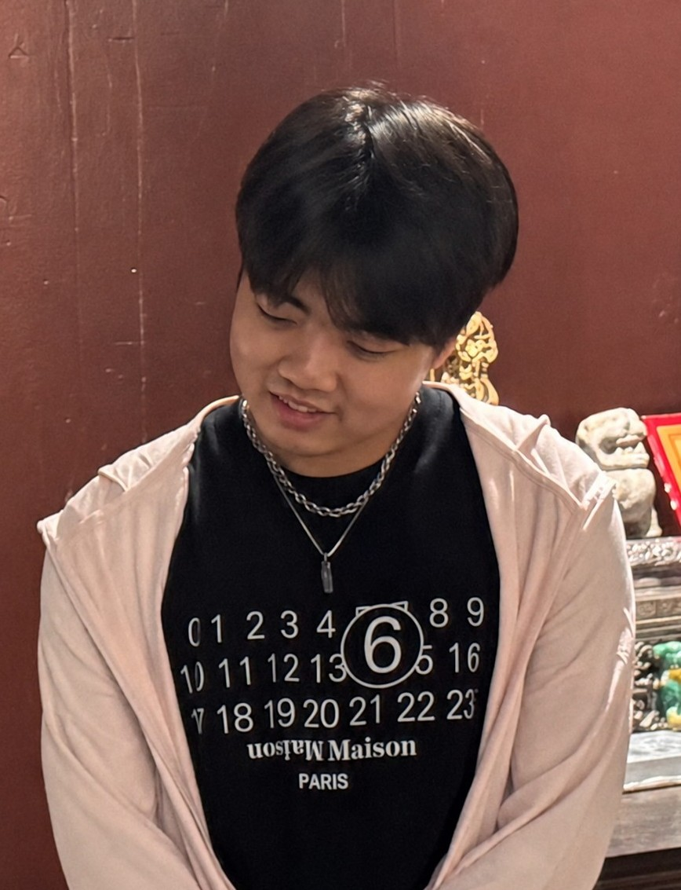

<table border="0">
  <tr>
    <td>
      <h1>Bo Fu</h1>
      
<b>Undergraduate Student Major in Computer Science</b>

        
<b><a href="https://dii.nju.edu.cn/kym_en/main.htm">Kuang Yaming Honors School</a>, <a href="https://www.nju.edu.cn/en/">Nanjing University</a></b>

      
<b>E-mail: <a href="mailto:bfurthe@gmail.com">bfurthe@gmail.com</a></b>

      
<b>Address: 163 Xianlin Avenue, Qixia District, Nanjing City, Jiangsu Province, China</b>

      <a href="/index-cn.html">Chinese Version</a>
    </td>
    <td width="25%">
      
    </td>
  </tr>
</table>

---

I'm Bo Fu from Nanjing University, now I'm major in Computer Science.

My CV can be seen from [CV.PDF (Click to See)](https://mosms.github.io/assets/files/CV.pdf).

My personal mo-(b)logs' website can be seen from [Mologs](https://mosms.github.io/Mologs/), if you are interested in this, you can browse this webpage.

If you have any form of **positive** suggestions, welcome to contact me.

---

+ Now this page is still under construction, where I will do more things in future.